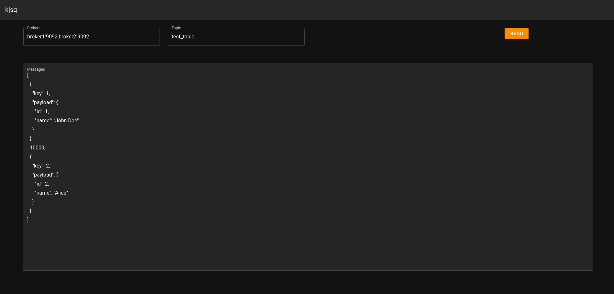

# kjsq
Produce a stream of kafka messages.

## How to use

```bash
$ npm install
$ node main.js
```

That starts a web server on http://127.0.0.1:3000


### Stream of messages

Is an array that can contain objects, numbers or strings.

If the element is an object it should have the following structure:

```js
// Object
{
    "key": 231, // [optional] used for partitioning
    "payload": "body" // message to send
}
```

If the element is number, then the producer waits `n` ms to send the next message.

If no key is specified the producer defaults to "0".

#### Example
```
[
  {
    "key": 1,
    "payload": {
      "id": 1,
      "name": "John Doe"
    }
  },
  10000,
  {
    "key": 2,
    "payload": {
      "id": 2,
      "name": "Alice"
    }
  },
  3000,
  "Bob"
]
```

The first message is sent with key: 1 and the payload indicated. Then the producer sleeps for 10 seconds and sends the second message with key: 2. Then it halts for 3 seconds and sends the message "Bob" with key: "0".

Try it yourself!



### API

If you prefer you can use the REST api instead of the web.

POST `/api/produce`
```
POST `/api/produce` {
    "kafkaHost": "broker1:9092,broker2:9092",
    "topic": "test_topic",
    "messages": [
        {
            "key": 1,
            "payload": {
                "id": 1,
                "name": "John Doe"
            }
        },
        10000,
        {
            "key": 2,
            "payload": {
                "id": 2,
                "name": "Alice"
            }
        },
        3000,
        "Bob"
    ]
}

Response
{
    "id": "d4c93279-b3ab-4695-9688-76a2de184e28",
    "state": {
        "status": "not_started",
        "messagesAcked": []
    }
}
```

GET `/api/state/:id`
```
GET `/api/state/d4c93279-b3ab-4695-9688-76a2de184e28`

Response
{
    "status": "done",
    "messagesAcked": [0, 2]
}
```

